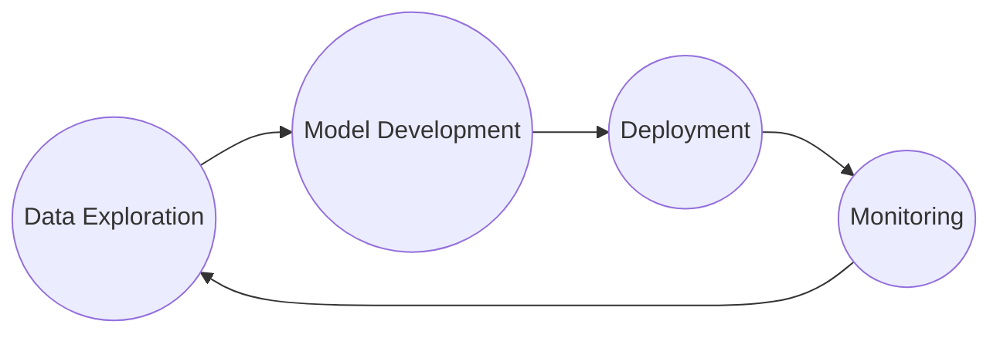

- potential biases, room for improvement


- same users are more like to use the same lanaguages for their tweets
- split data by users could be an improvement


contain duplicate:


- can make a tweet guideline, or recommendation on how to write lgbtq friendly tweet
- data has already been processed
- add confusion matrix for svm
- tweet with more than 10 characters
- pip install -r requirements.txt

# Machine Learning Life Cycle with LGBTQ Friendly Tweet Classifier

This project walks through a machine learning life cycle from data exploration to model development and deployment through building a LGBTQ Friendly Tweet Classifier. This process is no mean linear but iterative.




>**Disclaimer:** *The accuracy of the deployment model needs a lot more improvement. I hope you don't use the result of the deployment model to harm the community but to iterrate on it to make better models or porjects.*

## Authors

[@xingvoong](https://github.com/xingvoong)

## Run Locally

Clone the project

    git clone https://github.com/xingvoong/ml-life-cycle-with-lqbtq-friendly-tweet-classifier/tree/main/notebooks

Go to the project directory

    cd  ml-life-cycle-with-lqbtq-friendly-tweet-classifier

Creating and activating virtual enviroment

```
python3 -m venv env
source env/bin/activate
```
Install needed packages

    pip3 install -r requirements.txt


