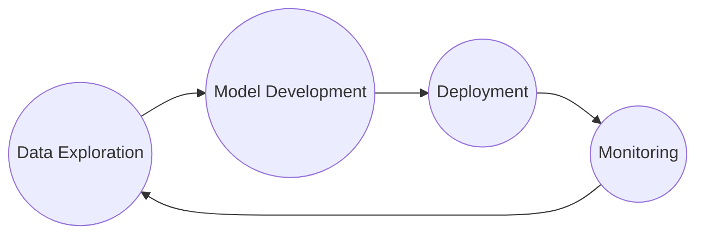

# Machine Learning Life Cycle with LGBTQ-Friendly Tweet Classifier

This project walks through a machine learning life cycle from data exploration to model development and deployment by building a LGBTQ Friendly Tweet Classifier. This process is no mean linear but iterative.



>**Disclaimer:** *The accuracy of the deployment model needs a lot more improvement. I hope you don't use the result of the deployment model to harm the community but to iterate on it to make better models or projects.*

## Authors

[@xingvoong](https://github.com/xingvoong)

## Data
The dataset and details about it can be found [here](https://www.kaggle.com/datasets/vencerlanz09/lgbt-tweets?resource=download).
## Features
The final product is an LGBTQ tweet classifier that takes in a tweet to classify whether it is LGBTQ-friendly. The thought process for developing the model can be found in **[Notebooks](https://github.com/xingvoong/ml-life-cycle-with-lqbtq-friendly-tweet-classifier/tree/main/notebooks)**. 

Flow 1


Flow 2

## Run Locally

Clone the project

    git clone https://github.com/xingvoong/ml-life-cycle-with-lqbtq-friendly-tweet-classifier/tree/main/notebooks

Go to the project directory

    cd  ml-life-cycle-with-lqbtq-friendly-tweet-classifier

Creating and activating virtual environment

```
python3 -m venv env
source env/bin/activate
```

Installing needed packages

    pip3 install -r requirements.txt
### To run the prototype Flask app
At the project root directory, run:

    python3 app.py

This will start the Flask development server, and you can access your application by navigating to `http://127.0.0.1:5000/` in your web browser.


## Notebooks

There are 4 notebooks for this project. They explain the decision-making process through each phrase of an ML life cycle. At the end of each notebook, there is a summary section that concludes the takeaways of each notebook or each phrase.

## Limitation and room for improvement

While the project succeeded in showcasing an ML life cycle, the model development phase has a lot of limitations and room for improvement. Some of which I can think of:

- Same users are more likely to use the same languages for their tweets, therefor splitting data by users could decrease biases.
- Right now, the final product only classifies whether a tweet is friendly. It could do more by making a guideline or suggestion on how to write friendly tweets.
- Adding a feature to let users rate whether a prediction is good or bad, then taking that new data to train better models.

## Acknowledgement
This project is made possible via the resources I am using and inspired by:
- [LGBT Tweets 🏳️‍🌈 dataset from Kaggle](https://www.kaggle.com/datasets/vencerlanz09/lgbt-tweets?resource=download) 
- [Hate-Speech-Detection-in-Social-Media-using-Python](https://github.com/NakulLakhotia/Hate-Speech-Detection-in-Social-Media-using-Python/tree/master) by [@NakulLakhotia](https://github.com/NakulLakhotia)
- The book [Building ML Powered Applications](http://bit.ly/mlpowered-oreilly) by   
[Emmanuel Ameisen](https://github.com/hundredblocks)
